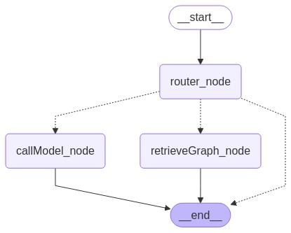
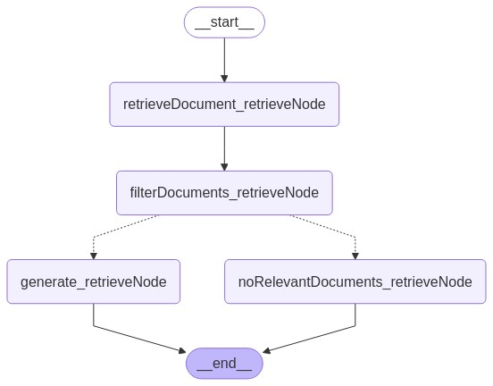

# NestJS LangGraph PGVector RAG

This project is a **NestJS** application that integrates **LangGraph**, **PGVector**, and **RAG (Retrieval-Augmented Generation)** to build a robust backend for managing users, threads, assets, and embeddings. It leverages modern technologies like **OpenAI**, **PostgreSQL**, and **TypeORM** to provide a scalable and efficient solution for AI-driven applications.

---

## Features

- **User Authentication**: Signup, signin, and token-based authentication using `jsonwebtoken`.
- **Thread Management**: Create, retrieve, and manage threads with prompts.
- **Asset Management**: Upload and manage assets with embedding generation and search capabilities.
- **Embedding Service**: Generate and search embeddings using OpenAI's embedding models.
- **LangGraph Integration**: Workflow orchestration for AI tasks.
- **PostgreSQL Vector Search**: Efficient similarity search using PGVector.
- **Modular Architecture**: Clean and scalable module-based structure.

---

## Technologies Used

- **NestJS**: Framework for building scalable server-side applications.
- **TypeORM**: ORM for database interactions.
- **PostgreSQL**: Relational database with PGVector for vector search.
- **LangChain**: AI workflow orchestration.
- **OpenAI**: GPT-4 and embedding models.
- **JWT**: Token-based authentication.
- **Zod**: Schema validation.
- **dotenv**: Environment variable management.

## Agent Workflow Diagrams

Below are the diagrams illustrating the main graph and subgraph for the **AgentWorkflow**:

### Main Graph



### Retrieve Graph

## 

## Project Structure

### Entities

- **User**: Represents application users.
- **Thread**: Represents threads with prompts.
- **Asset**: Represents assets with embedding status.

### Controllers

- **UserController**: Handles user-related endpoints (signup, signin, profile).
- **ThreadController**: Handles thread-related endpoints (create, retrieve, continue).
- **AssetController**: Handles asset-related endpoints (create, search documents).

### Services

- **UserService**: Manages user authentication and token validation.
- **ThreadService**: Manages thread creation, retrieval, and continuation.
- **AssetService**: Manages asset creation, embedding generation, and document search.
- **EmbeddingService**: Handles text splitting, embedding generation, and vector search.
- **AgentService**: Orchestrates AI workflows using LangGraph.
- **CheckpointerService**: Manages checkpoints using PostgreSQL.

---

## Installation

1. Clone the repository:

```bash
git clone <repository-url>
cd nestjs-langgraph-pgvector-rag
```

2. Install dependencies:

```bash
npm install
```

3. Configure environment variables:
   Create a `.env` file in the root directory and add the following:

```env
POSTGRES_DB_HOST=<your-postgres-host>
POSTGRES_DB_PORT=<your-postgres-port>
POSTGRES_DB_USERNAME=<your-postgres-username>
POSTGRES_DB_PASSWORD=<your-postgres-password>
POSTGRES_DB_DATABASE=<your-database-name>
PORT=3000
```

4. Run database migrations (if applicable).

---

## Running the Application

### Development

```bash
npm run start:dev
```

### Production

```bash
npm run build
npm run start:prod
```

---

## API Endpoints

### User

- `POST /user/signup`: Signup a new user.
- `POST /user/signin`: Signin an existing user.
- `GET /user/profile`: Get user profile.

### Thread

- `POST /thread`: Create a new thread.
- `POST /thread/:threadId/continue`: Continue a thread with a prompt.
- `GET /thread`: Get all threads for a user.
- `GET /thread/:threadId`: Get a specific thread.
- `GET /thread/:threadId/message`: Get messages for a thread.

### Asset

- `POST /asset`: Create a new asset.
- `GET /asset/:assetId/search-documents`: Search documents for an asset.

---

## License

This project is licensed under the **UNLICENSED** license.
